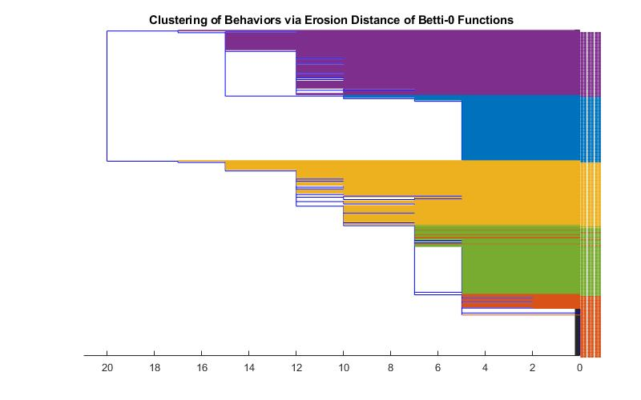
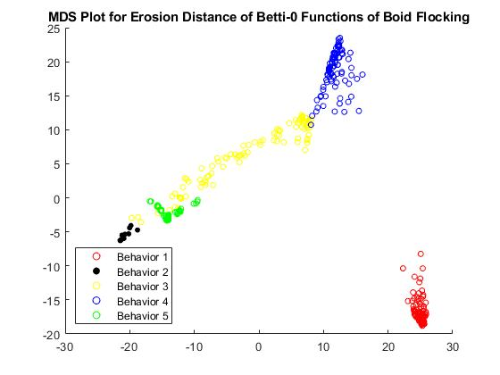

# Spatiotemporal Persistent Homology for Dynamic Data &
# Erosion Distance between Rank Invariants

A **dynamic metric space (DMS)** is a time series of distance functions over a fixed underlying set. Instance of DMSs include collective behaviors of animals (a flock of birds or a school of fish), and social networks in the human sphere. Here is one example of a collective flocking behavior of birds from the Rio Grande:

<p align="center">
<!--<kbd></kbd>-->
<kbd></kbd>
</p>

The code in this repository works to 
1. Compute the **spatiotemporal persistent Betti-0 function** and **Rank-Invariant** of **DMSs**, and in turn
2. Quantify the dissimilarity between two DMSs, based on their **spatiotemporal persistent topology**. For this, we make use of a slight generalization of [the erosion distance](https://link.springer.com/article/10.1007/s41468-018-0012-6) by Amit Patel.

In addtion, using this code, users can generate various DMSs according to [Boids model](https://en.wikipedia.org/wiki/Boids). Find real time simulations at the bottom of [this webpage](https://research.math.osu.edu/networks/formigrams/).

Also,   

3. Irrespective of DMSs, one can compute **the erosion distance between (the rank invariants of) 1-D persistence modules** (Added on Nov.8.2020); see **(Independent section) Erosion Distance between 1-D Persistence Modules** below.

<!--This code fill out the computational pipeline of taking in a dynamic metric space (DMS) generating a spatiotemporal Betti-0 function for it, and then compute erosion distance between these Betti-0 functions.--> 
The code is based on theoretical work by [Woojin Kim](https://wj-kim.com) and [Facundo Mémoli](https://people.math.osu.edu/memolitechera.1/) at Ohio State (see [*Spatiotemporal Persistent Homology for Dynamic Metric Spaces*](https://link.springer.com/article/10.1007/s00454-019-00168-w), published in Discrete & Computational Geometry, 2020).

<!--. The details can be found in the paper: [*Spatiotemporal Persistent Homology for Dynamic Metric Spaces*](https://link.springer.com/article/10.1007/s00454-019-00168-w), published in Discrete & Computational Geometry, 2020.-->
The code is authored by [Nate Clause](https://math.osu.edu/people/clause.15), a Math Ph.D. student at Ohio State, in collaboration with [Woojin Kim](https://wj-kim.com).

## Generating DMSs on a torus
<p align="center">
<!--<kbd></kbd>
<kbd></kbd>
<kbd></kbd>
<kbd></kbd>-->
<kbd></kbd>
</p>


**"boids_simulation.py"** generates DMSs on a **2-dimensional torus of width 500 units and height 250 units**, according to boids model. This code provides plenty of DMSs which can be useful for many different user's purposes.
<!--This code is added to give the user an example of how to generate DMS, as well as to have easily-made DMS available to test with the other codes.
-->
This code allows **two setttings of initial parameters** (this can be changed at the top of main):

```
python boids_simulation.py [num_points] [separation_force] [alignment_force] [cohesion_force] [dmsfile]
```

or:

```
python boids_simulation.py [num_points] [separation_force] [separation_radius] [alignment_force] [alignment_radius] [cohesion_force] [cohesion_radius] [dmsfile]
```

The forces and radii are parameters that alter the motion of the boids based on the rules based on the rules of [the model](https://en.wikipedia.org/wiki/Boids). Then [dmsfile] is the filename that the DMS data is saved out to. Instructions about parameter setting follow:
<!--The parameters should have the following ranges:
0 < [num_points] < infinity
0 <= [separation_force] < 10
0 <= [separation_radius] < infinity
0 <= [alignment_force] < 10
0 <= [alignment_radius] < infinity
0 <= [cohesion_force] < 10
0 <= [cohesion_radius] < infinity-->

The program can become slow if the number of points [num_points] go too high. **Anything at 100 or fewer points should run just fine**, more powerful infrastructures can handle hundreds of points (though for visual lag reasons, with more than 100 points, it is better to not show the plot as the program runs but instead to view the saved mp4 afterwards).
<!--We give a few remarks. First, the number of points is the main factor deciding the runtime, so while we can have arbitrarily many points, the program can become very slow if we let the number of points go too high. Anything at 100 or fewer points should run just fine, more powerful infrastructures can handle hundreds of points (though for visual lag reasons, with more than 100 points, it is better to not show the plot as the program runs but instead to view the saved mp4 afterwards).--> 

The force coefficients can be 0, meaning that force is playing no role in the simulation. **In contrast, making them more than 10 can make the simulation unstable.** It is best overall to keep all of these coefficients less than 5 for "smoothness" of the output.
<!--the force coefficients can be 0, this simply means that force is playing no role in the simulation. Technically, these coefficients could be input arbitrarily large, but making them more than 10 can make the simulation quite unstable. It is best overall to keep all of these coefficients less than 5 for "smoothness" of the output.-->

All the radius parameters can be arbitrarily large, but **there is no difference between having a radius parameter equal to the radius of the ambient space of motion and any larger parameter.** With our current **500x250** window, this means making one of these parameters more than ~350 will yield no change from if it were 350. 


## Computing Spatiotemporal Betti-0 function
<!--All of the codes are currently set up to be run from a command line, for example, the current approach to run "betti_generator.py" would be to enter command line or the terminal in a python IDE and write something such as:
```
python betti_generator.py [dmsfile] [bettifile] 40 0 50 5
```
All of these codes have portions at the top of main where the user can change the approach to how these functions are called/executed to another method as desired. Later, code will also be posted that exemplifies a larger-scale version with parallelization for generating Betti-0 functions as well as computing erosion distance between a large number of Betti-0 functions. -->

"betti_generator.py" is code that takes in a DMS file and generates a Betti-0 function for that DMS. This code relies on the software package Dionysus 2 (https://mrzv.org/software/dionysus2/). The code currently has one set of initial parameters:

```
python betti_generator.py [dmsfile] [bettifile] [start_threshold] [end_threshold] [spacing] [time_samples]
```

[dmsfile] and [bettifile] are the names of the files containing the input DMS and the output Betti-0 function, respectively. The threshold and spacing inputs determine the discretization values to be used for the Vietoris-Rips filtration when generating the Betti-0 function. Consider the following example input:

```
python betti_generator.py DMS1.txt Betti.txt 0 50 5 20
```

Then, for computing the Betti-0 function of **DMS1.txt**, the Vietoris-Rips complexes will be computed at the thresholds  0 (=**start_threshold**), 5, 10, ..., 50 (=**end_threshold**) and the Betti-0 function will be saved into a file named **Betti.txt**. The Betti-0 function will use 20 evenly spaced time samples from the DMS. i.e. if the DMS consists of 100 points moving through 1000 timesteps, the Betti-0 function will be based on 20 evenly spaced timesteps. The boids simulation currently is setup to use 1000 timesteps, but creating a Betti-0 function based on 1000 timesteps will be very slow, and computing the erosion distance between two Betti-0 functions of this size is not computationally feasible. The code is currently built so that the DMS file it reads in is a dynamic point cloud and then it computes the time series of distance matrices using Euclidean distance in the function "get_dist". This "get_dist" function is the one to change should the DMS be based on other metrics. In the future, additional functionality will be added so the user could input either a DMS as a dynamic point cloud or as a time series of distance matrices already. Of note is that the "boids_simulation.py" output is a dynamic point cloud, as the current "betti_generator.py" code is setup to handle.

As another important note, the code does not force the user to make the Rips threshold parameters reach a large enough scale so that the at all time the DMS under the VR filtration at each point in time will only have 1 connected component. However, for best results when computing erosion distance using the code discussed in the next section, it is highly recommended that you do so (in the worst case, one could simply make the end_threshold equal to the diameter of the space).

## Computing Erosion distance between Betti-0 functions. 
To compute the erosion distance between two Betti-0 functions, use the code "erosion_distance.py". The code can be run in two ways:

```
python betti0_erosion_distance.py [bettifile1] [bettifile2] 
```
```
python betti0_erosion_distance.py [bettifile1] [bettifile2] [time_weight] [scale_weight]
```

With the first input, the code would compute the erosion distance of the two Betti-0 functions and display this result. With the second input, the code would use the same Betti-0 functions, but changes the search direction for erosion distance. The default search direction in 3-space is -1,1,1 (in the x, y, and z directions, respectively), but for instance with time_weight 2 and scale_weight 3, the search direction would be -3,2,2. What this means intuitively is that if one weight is smaller than the other, that parameter is going to have more influence/importance in the distance computed. For example, if the parameters were 1 for time_weight and 5 for scale_weight, than the resulting distance would depend much more on how the Betti-0 functions differed in the time dimensions than the scale dimension. One should be careful to not use scaling factors too large relative to the size of the Betti-0 functions. For instance, if one had two 10-by-10-by-10 Betti-0 functions and used scaling weights of 11 in both parameters, then the only possible distances would be 0 or a maximum dependent on the spacing.

As an important note, the two Betti-0 functions can have different Rips threshold parameters used in their generation, but the spacing must be the same. For example, we could have one generated using Rips thresholds 0,5,10,...,50, and the other generated using 10,15,...,60, but we could not have one generated with thresholds 0,5,10,...,50, and the other generated with 0,7,14,...,70. Another important note regarding inputs is that the number of time samples used for generating the two Betti-0 functions being compared, the ([time_samples]) parameter in the code in the previous section, must be the same for the two functions.  

## Classification of DMSs
Here we outline a classification experiment we carried out. We generated 500 DMSs from the 5 different parameter settings below in the Boids model, one hundred DMS from each setting. Each DMS consists of 40 points and starts from a random initial configuration.
|  |  |
| --- | --- |
|**Setting 1**| separation 0, alignment 5, cohesion 0|
|**Setting 2**| separation 0, alignment 2, cohesion 5|
|**Setting 3**| separation 0, radius 0, alignment 1, radius 25, cohesion 2, radius 50|
|**Setting 4**| separation 0, radius 0, alignment 1, radius 150, cohesion 1, radius 50|
|**Setting 5**| Time-varying parameters. Details are omitted (One instance is illustrated as the gif above).|

We computed the Betti-0 functions of all the DMSs and computed pairwise erosion distances. We carried out the **Single Linkage Hierarchical Clustering** as well as the **Multidimensional Scaling**. The result is given below:

| SLHC  | MDS |
| ------------- | ------------- |
|   |   |

In SLHC, **Blue**= Setting 1, **Orange**=Setting 2, **Yellow** = Setting 3, **Purple** = Setting 4, **Green** = Setting 5.


## Rank Invariant of a DMS

"rank_generator.py" is code that takes in a DMS file and generates a rank invariant function for that DMS. This code relies on the software package Dionysus 2 (https://mrzv.org/software/dionysus2/). The code currently has one set of initial parameters:

```
python rank_generator.py [dmsfile] [rankfile] [start_threshold] [end_threshold] [spacing] [time_samples] [dimension]
```

[dmsfile] is the name of the file containing the input DMS. Then this code will output the rank invariant function, named [rankfile]. The threshold and spacing inputs determine the discretization values to be used for the Vietoris-Rips filtration when generating the rank invariant function. The dimension input determines which dimension the persistent homology is being computed with. Consider the following example input:

```
python rank_generator.py DMS1.txt Rank.txt 0 50 5 20 1
```
Then, for computing the rank invariant function of **DMS1.txt**, the Vietoris-Rips complexes will be computed at the thresholds  0 (=**start_threshold**), 5, 10, ..., 50 (=**end_threshold**) and the code will then compute the ranks between persistent homology inclusion maps using the persistent homology in dimension 1 (see paper cited in introduction for further theoretical details.) The rank invariant function will then be output to the file **Rank.txt**. Just as with Betti-0 functions, this input will use 20 evenly spaced time samples from the DMS. i.e. if the DMS consists of 100 points moving through 1000 timesteps, the rank invariant function will be based on 20 evenly spaced timesteps. Since rank invariant functions in this setting are 6-dimensional objects, instead of Betti-0 functions which are 3-dimensional objects, the runtime for generating rank invariants is correspondingly slower. To compensate for this, it is recommended to use a smaller number of Rips threshold parameters and time samples. As with the Betti-0 functions, the code is currently built so that the DMS file it reads in is a dynamic point cloud and then it computes the time series of distance matrices using Euclidean distance in the function "get_dist". This "get_dist" function is the one to change should the DMS be based on other metrics. In the future, additional functionality will be added so the user could input either a DMS as a dynamic point cloud or as a time series of distance matrices already. Of note is that the "boids_simulation.py" output is a dynamic point cloud, as the current "rank_generator.py" code is setup to handle.

## Erosion Distance between the Rank Invariants of DMSs

"rank_erosion.py" is code that takes in two rank invariant function files, generated by "rank_generator.py", and computes the erosion distance between them. The code has one set of initial parameters:
```
python rank_erosion.py [rankfile1] [rankfile2]
```
With this input, the code will compute the resulting erosion distance between the two rank invariant functions stored in **rankfile1** and **rankfile2**.

##  (Independent section) Erosion Distance between 1-D Persistence Modules

<!--"erosion_distance2D.py" is code that takes in two files containing the information of 2-dimensional modules, and computes erosion distance between them. The code has two sets of initial parameters:-->
Irrespective of DMSs, we describe how to compute the erosion distance between (the rank invariants of) 1-parameter persistence modules. "erosion_distance2D.py" takes in the rank invariants of any two 1-parameter persistence modules.
```
python erosion_distance2D.py [rankfile1] [rankfile2]
```
An examplary format of [rankfile1] or [rankfile2] is given below: 

<!--The 1st line contains information about the sampling of the input persistence module M over the real line: What this means is that M is stored in a discretized manner, and the 1st line must contain 3 values about this discretization. In order, they are the start value, end value, and spacing of this discretization. Then the remaining lines are the module itself, in a rectangular matrix form. For the standard setting of 2D modules representing rank invariants of 1-dimensional persistence modules, we have that this rank invariant really lies in the upper half plane. To deal with this, please set all the values in the bottom right of the matrix to equal -1 in the text file. For an example, one potential rank invariant file that would be accepted would read as follows:-->
  
0 8 2 \
2 3 4 5 5 \
3 4 4 5 -1 \
4 4 5 -1 -1 \
4 4 -1 -1 -1 \
4 -1 -1 -1 -1 

1. The first line contains discretized information about the input persistence module M over a finite real interval. In the above example, M is defined over the real interval [0,8] and, by setting the sample spacing 2, we only consider M restricted to 0,2,4,6,8. In other words, the three values are the start value (0), end value (8) of M, and spacing of sampling (2). 
2. The remaining lines encode the rank invariant in a rectangular matrix form (this form conforms with the standard representaion of rank invariant in the literature). Assume that there are k samples from M (in the above example, + ). For , the -entry is the rank of map M(-th sample -> +-th sample). For example, the (1,1)-entry 2 is the rank of M(), and the (5,1)-entry 4 is the rank of space M(0).  
3. Always set all the values below the main diagonal line to equal -1. 

<!--If this file were called "rankfile1", then this corresponds to a 2D module sampled at spacing 2 from 0 to 8. In the standard rank invariant approach to generating these modules, if PH is the 1-dimensional persistence module, then the upper left entry of the module (2) would correspond to the rank from PH(0) to PH(8). Similarly, 4 in the bottom left would correspond to the rank from PH(0) to PH(0), and 5 in the upper right would correspond to the rank from PH(8) to PH(8).
-->

### Weighted Erosion distance
```
python erosion_distance2D.py [rankfile1] [rankfile2] [x_weight] [y_weight]
```
<!--Here, rankfile1 and rankfile2 contain the information of the modules. -->
The x_weight and y_weight variables allow the user to change the search direction for the erosion distance computation. The defaults for these are x_weight = -1, y_weight = 1, which are the values one would wish to use for standard computation of erosion distance between rank invariants from 1-dimensional persistent homology computations. 
